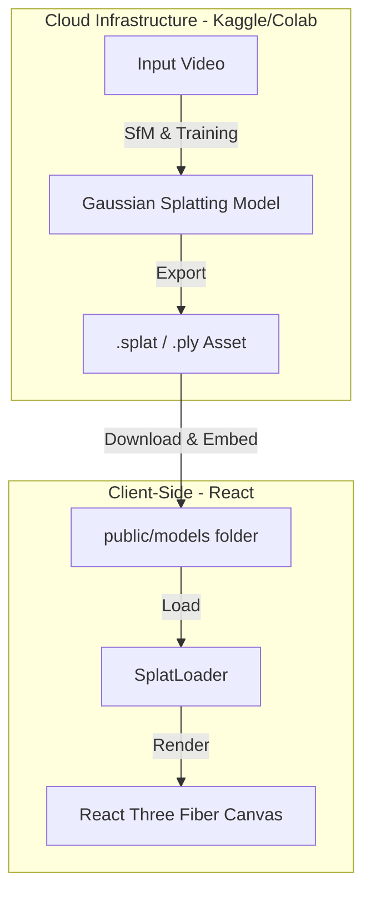

<div align="center">

# 3DGS Pipeline

### Web-Based 3D Gaussian Splatting

[](https://python.org)
[](https://pytorch.org)
[](https://reactjs.org)
[](https://threejs.org)

*Transform 2D video footage into photorealistic, interactive 3D scenes*

<!--  -->

[Demo](#demo) • [Features](#-features) • [Tech Stack](#-tech-stack) • [Getting Started](#-getting-started) • [Usage](#-usage)

</div>

---

## Overview

**3DGS Pipeline** is an end-to-end system for reconstructing photorealistic 3D scenes from 2D video footage. It leverages **3D Gaussian Splatting**, a state-of-the-art differentiable rendering technique that outperforms classical photogrammetry in both training speed and rendering quality.

This project bridges the gap between academic Computer Vision research and accessible web technologies, implementing:
- An **offline training pipeline** (PyTorch + CUDA)
- A **real-time web viewer** (WebGL/Three.js)

---

## Features

| Feature | Description |
|---------|-------------|
| **Structure from Motion (SfM)** | Automates extraction of camera extrinsic/intrinsic matrices from raw video frames to initialize training |
| **Differentiable Rasterization** | Optimizes position, covariance, opacity, and color (Spherical Harmonics) of millions of 3D Gaussians |
| **View-Dependent Lighting** | Models complex lighting effects using Spherical Harmonics coefficients for realistic appearance changes |
| **Web-Optimized Rendering** | Converts heavy `.ply` outputs into compressed binary formats for low-latency browser loading |
| **Real-Time Performance** | Achieves **60+ FPS** navigation using hardware instancing and optimized alpha-blending sort algorithms |

---

## Tech Stack

### AI & Processing Pipeline (Backend)

| Technology | Purpose |
|------------|---------|
|  | Core scripting and orchestration |
|  | Deep learning framework for scene optimization |
|  | GPU acceleration for gradient descent |
| **Nerfstudio (gsplat)** | 3D Gaussian Splatting training library |
| **COLMAP** | Structure from Motion for point cloud & camera pose estimation |

### Real-Time Rendering (Frontend)

| Technology | Purpose |
|------------|---------|
|  | UI framework for viewer interface |
|  | WebGL abstraction via React Three Fiber |
| **SplatLoader** | Custom loader for `.splat` / `.ply` files |
| **WebWorkers** | Asynchronous loading of large point cloud datasets |

---

## Architecture

The system utilizes a hybrid workflow to overcome local hardware limitations, offloading heavy compute (training) to cloud GPUs while maintaining a responsive local viewer.



---

## Project Structure

```bash
3dgs-pipeline/
├── notebooks/           # Python notebooks for Kaggle/Colab training
│   └── training.ipynb   # The main training script
├── public/              # Static assets
│   ├── scene.splat      # The trained 3D model (Binary)
│   └── index.html
├── src/                 # React source code
│   ├── components/
│   │   └── Viewer.js    # Three.js/Splat rendering logic
│   ├── App.js           # Main entry point
│   └── index.js
└── package.json
```

---

## Getting Started

### Prerequisites
* **Node.js & npm** (For the web viewer)
* **Kaggle Account** (For free GPU training access)

### Phase 1: Training the Model (Cloud)
Since 3DGS training requires significant VRAM, we use a cloud-based notebook.

1.  Open the [training notebook](./notebooks/training.ipynb) provided in this repository.
2.  Upload your target video (10-30s duration, static object).
3.  Run the pipeline to process data and train the Gaussian model.
4.  Download the generated `.splat` or `.ply` file.

### Phase 2: Running the Viewer (Local)
1.  Clone the repository:
    ```bash
    git clone https://github.com/Vasco888888/3dgs-pipeline.git
    cd 3dgs-pipeline
    ```

2.  Install dependencies:
    ```bash
    npm install
    ```

3.  **Import your model:**
    * Place your downloaded `scene.splat` file into the `public/` folder.
    * (Optional) Update the filename in `App.js` if it differs from `scene.splat`.

4.  Start the development server:
    ```bash
    npm start
    ```
    Open [http://localhost:3000](http://localhost:3000) to view the reconstruction.

## Known Limitations
* **Mobile Performance:** Rendering millions of splats requires a decent GPU; mobile performance may vary.
* **File Size:** High-fidelity scans can exceed 100MB, requiring optimization for faster web loading.

---

## License

This project is licensed under the MIT License.

---

## Acknowledgments

- [3D Gaussian Splatting](https://repo-sam.inria.fr/fungraph/3d-gaussian-splatting/) - Original research paper
- [Nerfstudio](https://docs.nerf.studio/) - Training framework
- [COLMAP](https://colmap.github.io/) - Structure from Motion

---

<div align="center">

</div>